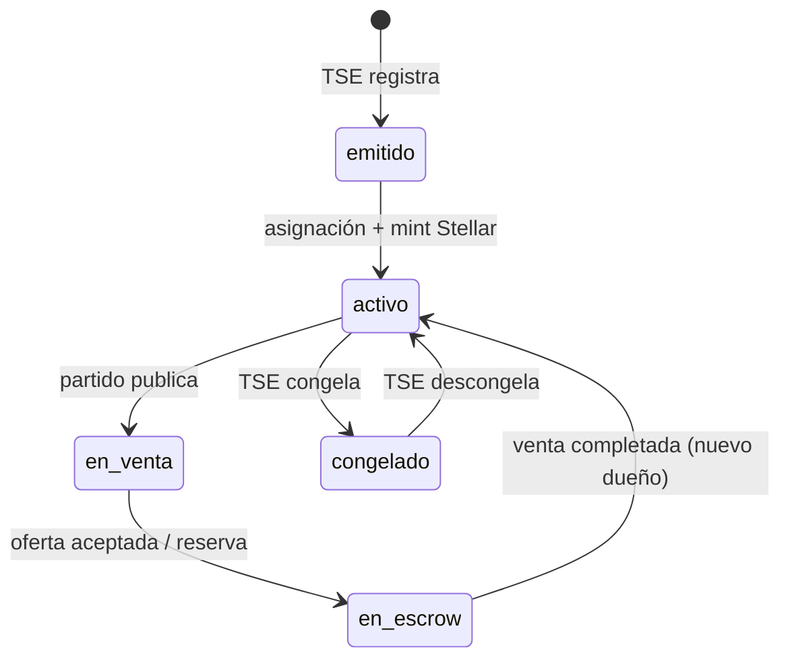

# VELAR · Spec

### Contratos estables entre código, contratos Soroban y documentación

**Fuente de verdad declarativa** para estados, eventos de auditoría, métodos de pago y payloads compartidos por [Velar](https://github.com/Velar-Bonds/Velar), [velar-contracts](https://github.com/Velar-Bonds/velar-contracts) y [velar-docs](https://github.com/Velar-Bonds/velar-docs).

[Documentación](./docs/README.md) · [Changelog](./CHANGELOG.md) · [Ejemplos](../velar-examples)

---

## ¿Por qué existe este repo?

VELAR cruza **Postgres**, **REST**, **Stellar Classic**, **Soroban** y **Trustless Work**. Sin un spec versionado, cada repo puede divergir (nombres de estados, eventos, métodos de pago).

Este repositorio concentra:

| Carpeta | Contenido |
|---------|-----------|
| [`schemas/`](./schemas/) | JSON Schema de entidades y enums |
| [`docs/`](./docs/) | Máquinas de estado, reglas de negocio, compliance |
| [`openapi/`](./openapi/) | Contrato HTTP (snapshot; la implementación vive en Velar) |

> **Regla:** si cambiás un enum en `@velar/types`, actualizá el schema correspondiente aquí en el mismo PR (o issue vinculado).

---

## Versionado

| Versión | Estado | Notas |
|---------|--------|-------|
| **v1.0** | `draft` | CR testnet, flujos P2P + wallet DvP |

Etiquetas Git: `spec-v1.0.0`, `spec-v1.1.0`, …

---

## Entidades principales

Ver [`docs/states.md`](./docs/states.md) para transferencias y métodos de pago.

---

## Schemas incluidos

| Archivo | Descripción |
|---------|-------------|
| [`bond-status.json`](./schemas/bond-status.json) | Estados del bono |
| [`transfer-status.json`](./schemas/transfer-status.json) | Estados de negociación |
| [`payment-method.json`](./schemas/payment-method.json) | `sinpe` \| `transferencia` \| `wallet` |
| [`audit-event-type.json`](./schemas/audit-event-type.json) | Eventos append-only |

---

## Consumidores

| Repo | Uso |
|------|-----|
| **Velar** | `packages/types` debe reflejar estos schemas |
| **velar-contracts** | Estados Soroban ↔ spec |
| **velar-docs** | Docs humanas generadas / enlazadas desde aquí |
| **velar-examples** | Payloads de ejemplo válidos |

---

## Contribuir

1. Propón cambio en `docs/` + schema JSON.  
2. Bump versión en `CHANGELOG.md`.  
3. Abre PR; etiqueta `spec-breaking` si rompe compatibilidad.

Ver [CONTRIBUTING.md](./CONTRIBUTING.md).

---

VELAR · Transparencia verificable · <a href="https://github.com/Velar-Bonds">Velar-Bonds</a>

